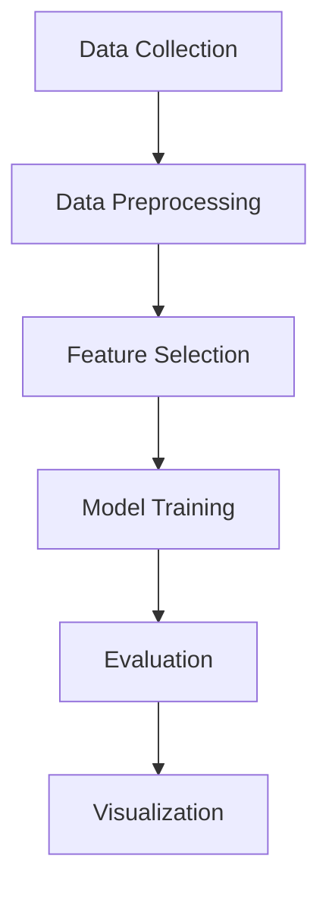

# 🧠 Mental Health Detection using Machine Learning

This project aims to detect the need for mental health treatment using survey-based behavioral, emotional, and workplace-related data. Leveraging various machine learning and deep learning models, it provides predictive insights that can assist in early intervention and promote mental well-being.

## 📌 Table of Contents

- [Introduction](#introduction)
- [Problem Statement](#problem-statement)
- [Objectives](#objectives)
- [Dataset Description](#dataset-description)
- [Tools & Technologies](#tools--technologies)
- [System Architecture](#system-architecture)
- [Models Used](#models-used)
- [Evaluation Metrics](#evaluation-metrics)
- [Results](#results)
- [Future Scope](#future-scope)
- [How to Run](#how-to-run)
- [Acknowledgments](#acknowledgments)

## 🧾 Introduction

Mental health issues are on the rise, often going undiagnosed due to stigma or delayed intervention. This project uses survey data and machine learning to build a predictive model capable of identifying individuals likely to require mental health treatment.

## ❓ Problem Statement

Due to the subjective nature of mental health symptoms and underreporting, traditional diagnostic methods often fall short. A data-driven approach can enhance early detection and promote mental wellness strategies in personal and professional environments.

## 🎯 Objectives

- Analyze mental health survey data across various demographics.
- Identify significant behavioral and workplace factors.
- Train machine learning models to predict treatment need.
- Visualize insights to support better mental health policies.

## 📊 Dataset Description

- **Source**: Kaggle
- **Size**: ~292,364 rows × 17 columns
- **Attributes**: Gender, Country, Occupation, Family History, Stress Levels, Mood Swings, Work Interest, etc.
- **Target Variable**: `treatment` (Yes/No)

## 🛠️ Tools & Technologies

- **Languages**: Python
- **Frameworks**: TensorFlow, Keras, Scikit-learn
- **Libraries**: Pandas, NumPy, Matplotlib, Seaborn
- **Visualization**: Power BI
- **IDE**: Jupyter Notebook / Google Colab

## 🧱 System Architecture



## 🤖 Models Used

- **K-Nearest Neighbors (KNN)**
- **Random Forest Classifier**
- **AdaBoost Classifier**
- **XGBoost**
- **Artificial Neural Network (ANN)**

## 📈 Evaluation Metrics

| Model          | Accuracy | Precision | Recall | F1-Score | AUC  |
|----------------|----------|-----------|--------|----------|------|
| KNN            | ~72%     | 0.72      | 0.72   | 0.72     | -    |
| Random Forest  | ~75%     | 0.78      | 0.71   | 0.75     | -    |
| AdaBoost       | ~72%     | 0.72      | 0.72   | 0.72     | -    |
| XGBoost        | 78.42%   | 0.82      | 0.72   | 0.77     | ~0.89 |
| ANN            | **80.31%** | 0.80    | 0.84   | 0.82     | **0.91** |

## 🏁 Results

- **Best Model**: ANN with 80.31% accuracy and 0.91 AUC.
- **Insights**: Gender, occupation, country, and family history significantly affect mental health treatment trends.
- **Visualizations**: Treatment distribution by country and gender using pie, clustered, and stacked column charts.

## 🔮 Future Scope

- Integrate **real-time data** from wearables, apps, and social media.
- Localize models for **Indian languages and culture**.
- Develop a **web/mobile app** for rural mental health self-assessment.

## ▶️ How to Run

1. Clone this repository.
2. Install required libraries:
   ```bash
   pip install -r requirements.txt
   ```
3. Run the Jupyter Notebook or upload to Google Colab.
4. Load the dataset and execute each cell sequentially.
5. Visualizations and model evaluations will be generated.

## 🙏 Acknowledgments

- Dataset Source: Kaggle
- Libraries: Scikit-learn, TensorFlow, Keras, Pandas, Matplotlib
- Visualization: Microsoft Power BI
